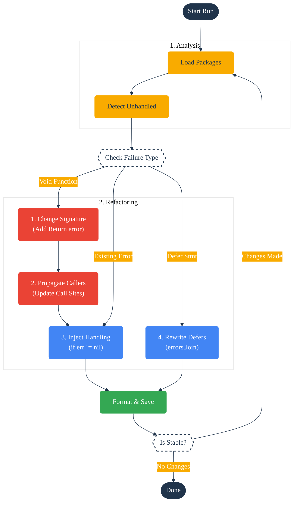

go-auto-err-handling
====================

[](https://opensource.org/license/apache-2-0)
[](https://github.com/SamuelMarks/go-auto-err-handling/actions/workflows/ci.yml)

**go-auto-err-handling** is an advanced static analysis and refactoring tool designed to eliminate technical debt
associated with unhandled errors in Go.

Unlike standard linters that merely report ignored errors, this tool **automatically injects idiomatic error handling**.
It intelligently refactors function signatures, propagates errors up the call stack, handles deferred errors via
[`errors.Join`](https://pkg.go.dev/errors#Join) (Go 1.20+), and strictly adheres to your project's coding standards
through customizable templates.

## 🏗 Architecture

The tool is built upon `golang.org/x/tools/go/packages` and operates in a stabilizing loop. It modifies the AST (
Abstract Syntax Tree), type-checks iteratively to ensure safety, and formats the output. FYI: Comments are preserved.



## 🚀 Key Features

* **Recursive Refactoring**: Runs up to 5 passes to ensure that signature changes (adding `error` return types)
  propagate correctly to all callers and entry points.
* **Smart Zero-Values**: Uses `pkg/astgen` to calculate valid zero-values (e.g., `return 0, "", nil, err`) for return
  statements based on `go/types` information.
* **Panic Conversion**: Can automatically rewrite explicit `panic(err)` calls into `return fmt.Errorf(...)` (via
  `--panic-to-return`).
* **Defer Safety**: Rewrites simple `defer f()` calls that return errors into closures using `errors.Join` to ensure
  deferred errors are captured.
* **Filter & Compliance**:
    * Excludes specific files (`*_test.go`, generated files) or symbols (`fmt.Println`) via globs.
    * Checks for interface compliance to ensure refactoring doesn't break interface implementation contracts.
* **Entry Point Safety**: Automatically detects `main()` and `init()` and injects terminal handling (Log/Fatal/Exit)
  instead of changing signatures.

## 📦 Installation

**Prerequisites**: Go 1.22 or higher.

```bash
go install github.com/SamuelMarks/go-auto-err-handling@latest
```

## 🛠 Usage

The tool operates with diff-like logic. By default, it runs in **Dry Run** mode to show you what will change.

### Refactoring Strategies (Levels)

1. **Level 0: Local Pre-existing Errors** (`--local-preexisting-err`)
    * Fixes ignored errors in functions that *already* return an `error`.
    * *Effect*: Injects `if err := call(); err != nil { return ..., err }`.

2. **Level 1: Local Non-existing Errors** (`--local-nonexisting-err`)
    * Targets functions that do *not* currently return an error.
    * *Effect*: Changes signature (`func Foo()` -> `func Foo() error`), updates all returns, and propagates the
      signature change to all callers recursively.

3. **Level 2: Third Party Errors** (`--third-party-err`)
    * Treats ignored calls to external libraries (like `os.WriteFile`) as critical, forcing the enclosing function to
      handle or return the error.

### Common Commands

**Preview changes (Dry Run):**

```bash
auto-err --local-nonexisting-err --dry-run ./...
```

**Apply changes recursively with custom template:**

```bash
auto-err \
  --local-nonexisting-err \
  --error-template '{return-zero}, fmt.Errorf("failed in {func_name}: %w", err)' \
  ./pkg/...
```

**Verify codebase in CI (Exit 1 if errors found):**

```bash
auto-err --check ./...
```

## ⚙️ Configuration

Options can be controlled via CLI flags.

| Flag                      | Description                                                             | Default              |
|:--------------------------|:------------------------------------------------------------------------|:---------------------|
| `--dry-run`               | Print diffs to stdout; do not modify files.                             | `false`              |
| `--check`                 | CI mode. Implies dry-run. Exits with 1 if issues found.                 | `false`              |
| `--exclude-glob`          | Glob patterns for files to exclude (e.g., `*_test.go`).                 | `[]`                 |
| `--exclude-symbol-glob`   | Symbols to ignore (e.g., `fmt.Println`, `bytes.Buffer.Write`).          | `[]`                 |
| `--main-handler`          | Strategy for `main/init`: `log-fatal`, `os-exit`, `panic`.              | `log-fatal`          |
| `--error-template`        | Template for returns. Variables: `{return-zero}`, `{func_name}`, `err`. | `{return-zero}, err` |
| `--no-default-exclusions` | Disable built-in ignore list (fmt, log, etc.).                          | `false`              |

### Default Exclusions

Unless `--no-default-exclusions` is set, the following are ignored to reduce noise:

* `fmt.Print*`, `fmt.Sprint*`, `fmt.Scan*`
* `log.Print*`, `log.Output`
* `strings.Builder.Write*`
* `bytes.Buffer.Write*`

## 🏗 Project Structure

* `pkg/analysis`: AST detection logic and `InjectionPoint` identification.
* `pkg/astgen`: Generation of AST nodes for zero values (`0, "", nil`).
* `pkg/filter`: Glob matching and testing logic.
* `pkg/loader`: Wrapper around `golang.org/x/tools/go/packages` with smart module recursion.
* `pkg/refactor`: Type-aware refactoring (signature changes, propagation).
* `pkg/rewrite`: AST rewriting logic (injecting `if` blocks, rewriting `defer`/`go`).
* `pkg/runner`: Main execution loop, stabilization, and formatting.

## 📄 License

Licensed under the [Apache 2.0 License](LICENSE-APACHE).
